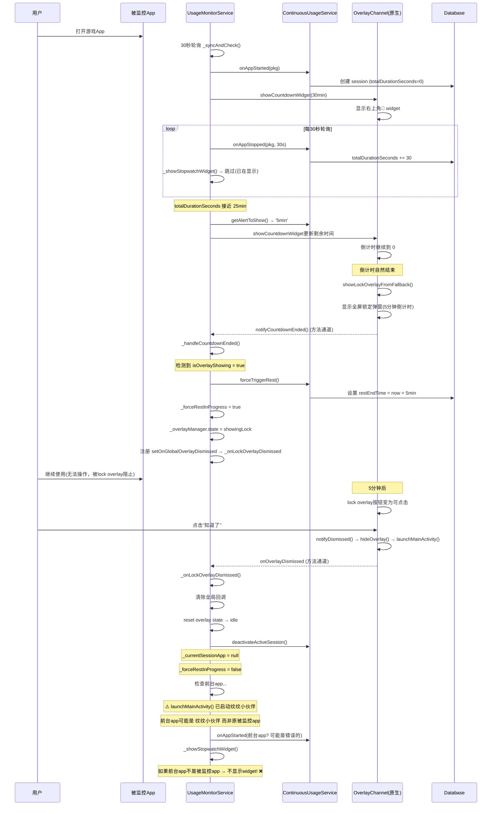
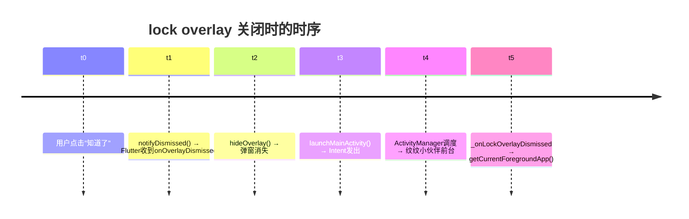

# 连续使用限制 — 完整逻辑流程图

## 1. 核心概念

| 组件 | 说明 |
|------|------|
| ContinuousSession | DB中的活跃会话，记录 totalDurationSeconds、restEndTime |
| 右上角 countdown widget | 原生侧(OverlayChannel)显示的圆形渐变悬浮窗，显示 MM:SS 倒计时 |
| lock overlay | 原生侧全屏锁定弹窗，带倒计时按钮，休息期间阻止操作 |
| ContinuousUsageService | Flutter业务逻辑：检查状态、触发休息、管理会话 |
| UsageMonitorService | 30秒轮询协调器：状态同步、规则检查、widget显示控制 |

### 状态标志 (内存中)

| 标志 | 类型 | 说明 |
|------|------|------|
| `_countdownWidgetShowing` | bool | Flutter侧认为countdown widget是否在显示 |
| `_stopwatchWidgetShowing` | bool | 同_countdownWidgetShowing（冗余字段） |
| `_countdownEnding` | bool | 倒计时结束处理中（防重复） |
| `_forceRestInProgress` | bool | 强制休息中（lock overlay显示期间）= true，阻止轮询干扰 |
| `_isSessionActive` | bool | 当前是否有监控app在使用中 |
| `_countdownTriggerApp` | String? | 触发countdown widget的app包名 |
| `_overlayManager.state` | enum | idle / showingReminder / showingCountdown / showingLock |

### 配置参数

```
limitMinutes = 30  → 限制时长
restMinutes = 5    → 休息时长
```

---

## 2. 第一轮：正常流程



---

## 3. 根因分析

### 🔴 根本原因: `launchAppOnDismiss=true` 改变了前台app

`showLockOverlayFromFallback()` 中 `launchAppOnDismiss = true`。

用户关闭 lock overlay 时，原生侧顺序执行：
1. `notifyDismissed()` → 异步通知Flutter
2. `hideOverlay()` → 隐藏弹窗
3. **`launchMainActivity()` → 启动纹纹小伙伴的 MainActivity**

然后在 `_onLockOverlayDismissed` 第490行：
```dart
final currentApp = await UsageStatsService.getCurrentForegroundApp();
```

此时 `launchMainActivity()` 已经被调用，前台 app 可能已变为 `com.qiaoqiao.qiaoqiao_companion`（纹纹小伙伴自身），**不是被监控的 app**。

→ `monitoredApps.isMonitored(currentApp)` = **false**
→ `_showStopwatchWidget` 被跳过
→ **widget 不显示 ("很久不弹出")**

### 🟡 为什么第一轮有时正常，后续错乱？

因为 **时序竞态条件**：
- `notifyDismissed()` 是异步方法通道调用
- `launchMainActivity()` 是 ActivityManager 调度（也需要时间）
- 如果 Flutter 在 `launchMainActivity()` 生效**之前**处理了 `onOverlayDismissed` → `getCurrentForegroundApp()` 返回正确的被监控app → ✅ 正常
- 如果 Flutter 在 `launchMainActivity()` 生效**之后**处理 → 返回纹纹小伙伴 → ❌ 失败

后续轮次中 Android Activity 栈状态不同（可能有多个 Activity 处于 resumed/paused 状态），增加了不确定性。

### 🟡 "过一段时间突然出现 → 消失" 的原因

- 用户手动切回被监控app → `_handleContinuousUsageTransition` → `onAppStarted` → `_showStopwatchWidget` → widget 出现
- 用户短暂切到其他app → 延迟确认机制(60秒) → `_hideStopwatchWidget` → widget 消失
- 用户再切回来 → widget 再次出现
- 如果用户不再切回 → widget 永久消失

---

## 4. 修复方案

### 修复1: 在 `_onLockOverlayDismissed` 中保存最后使用的app名

**问题**: `_countdownTriggerApp` 和 `_currentSessionApp` 在 lock overlay 关闭前已被设 null。

**方案**:
- 新增 `_lastLockedApp` 字段，在 `_handleCountdownEnded` 中保存
- 在 `_onLockOverlayDismissed` 中使用 `_lastLockedApp` 替代实时前台app查询

### 修复2: `_onLockOverlayDismissed` 中的前台app检查

```mermaid
flowchart TD
    A[lock overlay 关闭] --> B{_lastLockedApp != null?}
    B -->|Yes| C[使用 _lastLockedApp 作为目标app]
    B -->|No| D[回退到实时查询前台app]
    C --> E{isMonitored(targetApp)?}
    D --> E
    E -->|Yes| F[onAppStarted 创建新session]
    E -->|No| G[不显示widget]
    F --> H[_showStopwatchWidget]
```

---

## 5. 完整状态转换图

```mermaid
stateDiagram-v2
    [*] --> NormalUse: 打开被监控app
    
    NormalUse --> CountdownWidget: 剩余5分钟
    
    state CountdownWidget {
        [*] --> Counting: 显示倒计时
        Counting --> Alert3min: 剩3分钟
        Counting --> Alert2min: 剩2分钟
        Counting --> CountdownEnd: 到0
        Alert3min --> Counting
        Alert2min --> Counting
    end
    
    CountdownEnd --> LockOverlay: 原生路径(showLockOverlayFromFallback)
    
    state LockOverlay {
        [*] --> Locked: 显示全屏弹窗
        Locked --> LockDismiss: 5分钟后可关闭
    end
    
    LockOverlay --> [_forceRestInProgress=true]
    
    LockDismiss --> _onLockOverlayDismissed
    
    state _onLockOverlayDismissed {
        [*] --> ClearCallbacks: 清理全局回调
        ClearCallbacks --> ResetState: reset overlay state
        ResetState --> DeactivateSession: 停用旧会话
        DeactivateSession --> ForceRestInProgressFalse: _forceRestInProgress=false
        ForceRestInProgressFalse --> CheckApp: 检查目标app(使用_lastLockedApp)
        CheckApp --> CreateNewSession: onAppStarted
        CreateNewSession --> ShowWidget: _showStopwatchWidget
    end
    
    ShowWidget --> CountdownWidget: 第二轮开始
    
    CountdownWidget --> LockOverlay: 第二轮用完
    LockOverlay --> _onLockOverlayDismissed: 再次关闭
    
    _onLockOverlayDismissed --> [*]: 循环
    
    LongPressHome --> [*]: 用户离开app
```

---

## 6. 关键时序窗口



- ✅ 如果 `t5` 在 `t4` 之前 → 返回被监控app → widget 正确显示
- ❌ 如果 `t5` 在 `t4` 之后 → 返回纹纹小伙伴 → widget 不显示

修复后：不依赖 `getCurrentForegroundApp()`，使用保存的 `_lastLockedApp`。
