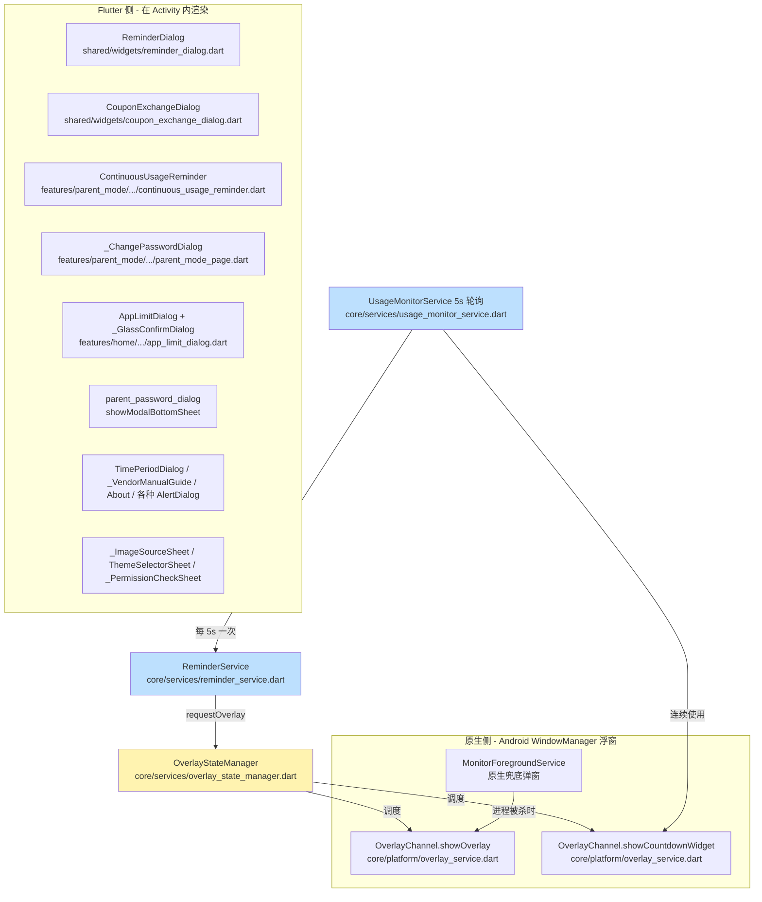
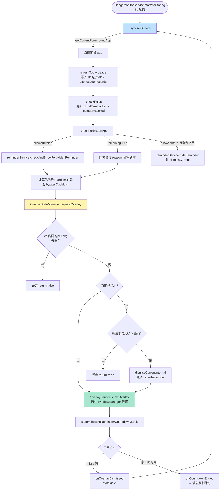
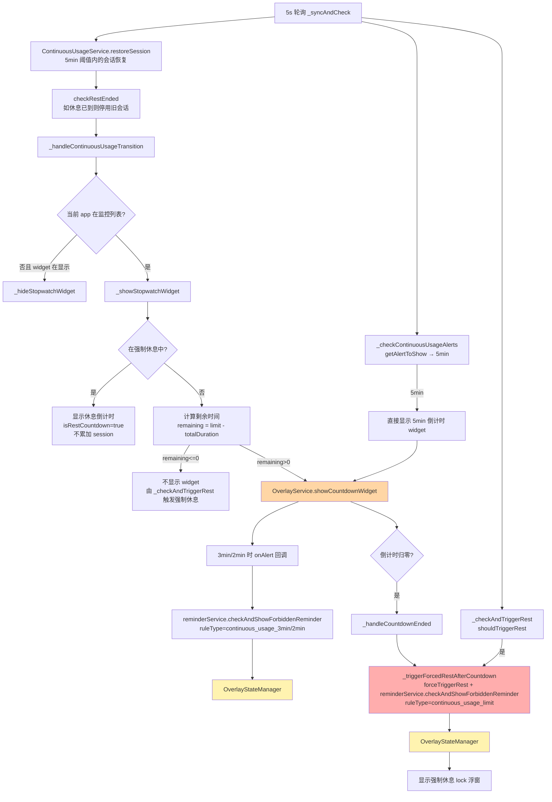
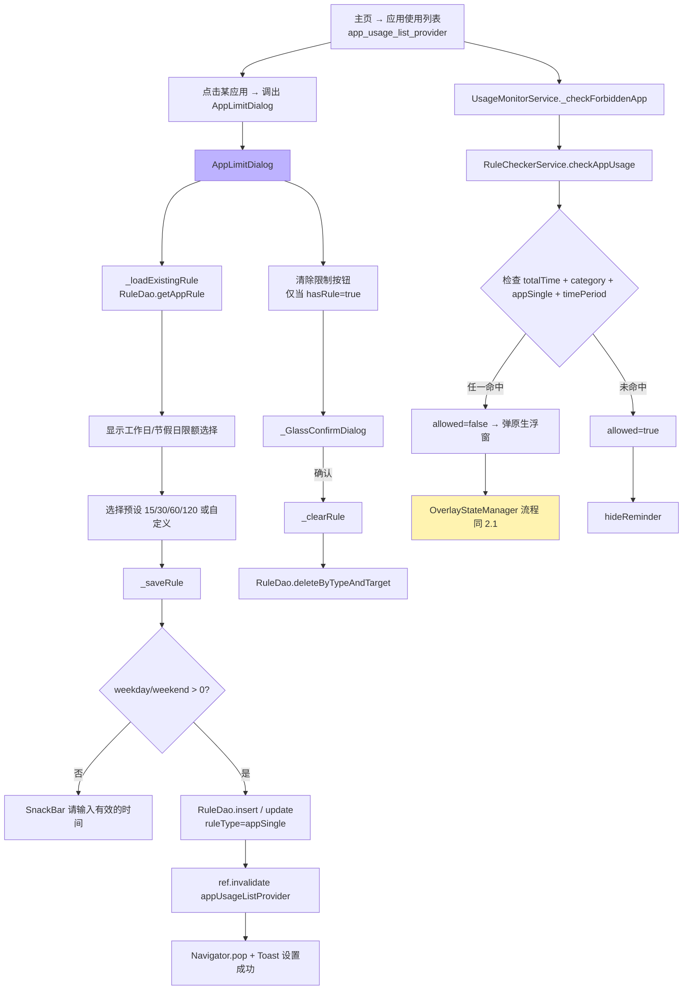
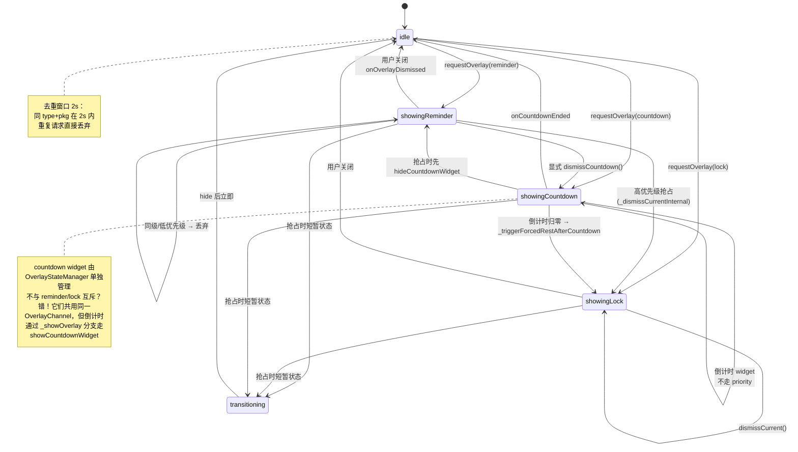

# 弹窗 & Widget 流程梳理（排查问题速查手册）

> 目标：把所有 `showDialog` / `showModalBottomSheet` / `OverlayService.showOverlay` / 主要 widget 的入口、触发链路、回调关系画清楚，方便定位"弹窗不弹""弹窗错乱""回调没执行"等问题。
>
> 适用范围：`qiaoqiao_companion/lib/`
> 文档版本：2026-06-03
> 关键设计：**Flutter 侧弹窗**（`showDialog`/`showModalBottomSheet`）与 **原生侧弹窗**（`OverlayService` 通过 Native Channel 唤起 Android `WindowManager` 浮窗）两套并存，由 `OverlayStateManager` 做统一调度。

---

## 0. 双轨弹窗体系概览



**关键点**：
- **Flutter 侧弹窗**只能在 `qiaoqiao_companion` Activity 处于前台时显示（受限 dialog 体系）。
- **Native 侧弹窗**（`OverlayChannel`）使用 `WindowManager` 浮窗，**即使 app 被划到后台、Activity 已销毁、屏幕被锁定**也能显示。这是为什么"游戏 app 还在前台、巧巧被划走"也能弹提醒的原因。
- 进程被强杀时，原生 `MonitorForegroundService` 还能独立弹窗（兜底）。

---

## 1. 弹窗 & Widget 一览表

### 1.1 Flutter 侧弹窗（`showDialog` / `showModalBottomSheet`）

| 弹窗 | 文件:行号 | 入口方式 | 触发场景 | 关键回调 / 副作用 |
|---|---|---|---|---|
| `ReminderDialog` (4 个静态方法) | `shared/widgets/reminder_dialog.dart:517-593` | `ReminderDialogHelper.showGentle/Serious/Final/Locked` | **已废弃路径**，原提醒流程入口；现在主要由 `OverlayStateManager` 调度原生浮窗替代 | `onConfirm` / `onExtend`（加时券） |
| `CouponExchangeDialog` | `shared/widgets/coupon_exchange_dialog.dart:774` | `showCouponExchangeDialog(context, currentPoints, onExchange)` | 主页"兑换加时券"按钮、家长发券页 | `onExchange(CouponConfig)` → 由调用方实现扣积分/写库 |
| `ContinuousUsageReminder` | `features/parent_mode/presentation/widgets/continuous_usage_reminder.dart:223` | `showContinuousUsageReminder(context, remainingSeconds, alertLevel, onDismiss, onRestNow)` | 连续使用 5min/2min 警告（**目前未在主流程中调用，留作备用**） | `onDismiss` / `onRestNow` |
| `_ChangePasswordDialog` | `features/parent_mode/presentation/parent_mode_page.dart:383` | `showDialog(builder: => _ChangePasswordDialog())` | 家长模式 → 修改密码 | `parentAuthProvider.notifier.resetPassword(old, new)` |
| `AppLimitDialog` | `features/home/presentation/widgets/app_limit_dialog.dart:13` | `showDialog` | 主页"应用使用列表"→ 单个应用 → 设置时间限制 | `_saveRule()` 写 `RuleDao`；`_clearRule()` 删除；内嵌 `_GlassConfirmDialog`（行 538） |
| `_GlassConfirmDialog`（私有） | `features/home/presentation/widgets/app_limit_dialog.dart:779` | `_showClearConfirmDialog()` | 清除应用限制前的二次确认 | `onConfirm` → `_clearRule()` |
| `_ParentPasswordSheet` | `features/parent_mode/presentation/parent_password_dialog.dart:9` | `showParentPasswordDialog(isSettingPassword)` | ①进入家长模式（验证密码）<br/>②家长模式 → 设置密码 | `parentAuthProvider.setPassword` / `.verifyPassword`；成功后 `Navigator.pop(true)` |
| `_TimePeriodDialog` | `features/parent_mode/presentation/tabs/time_periods_tab.dart:220 / 234` | `showDialog<TimePeriod>` | 添加/编辑"禁止时段" | `Navigator.pop(period)` → `timePeriodsProvider.add/update` |
| 删除时段确认 | `features/parent_mode/presentation/tabs/time_periods_tab.dart:195` | `showDialog<bool>(AlertDialog)` | 删除时段前确认 | `Navigator.pop(true/false)` |
| 移除监控应用确认 | `features/parent_mode/presentation/tabs/app_management_tab.dart:116` | `showDialog<bool>(AlertDialog)` | 删除监控应用前确认 | 同上 |
| 监控应用每日限制选择 | `features/parent_mode/presentation/widgets/monitored_app_card.dart:266` | `showDialog(AlertDialog)` | 单个监控 app → 设置每日限制（简单版 ListView） | `onUpdate(app.copyWith(dailyLimitMinutes: ...))` |
| 备份恢复/删除确认 | `features/settings/presentation/backup_restore_page.dart:233 / 279` | `showDialog<bool>(AlertDialog)` | 恢复备份 / 删除所有备份 | `Navigator.pop(true/false)` |
| 关于弹窗 | `features/settings/presentation/settings_page.dart:561` | `showDialog(AlertDialog)` | 设置 → 关于 | 仅显示 |
| 自启动手动引导 | `features/onboarding/presentation/vendor_permission_guide_page.dart:210` | `showDialog(AlertDialog)` | 厂商自启动权限自动跳转失败时 | 引导用户手动设置 |
| `_ImageSourceSheet` | `features/home/presentation/home_page.dart:577` | `showModalBottomSheet<String>` | 主页巧巧头像 → 更换头像 | 返回 `'camera' / 'gallery' / 'delete'` |
| `ThemeSelectorSheet` | `shared/widgets/theme_selector_sheet.dart:193` | `ThemeSelectorSheet.show(context)` | 设置 → 切换主题 | 调用 `themeProvider.notifier.setTheme` |
| `_PermissionCheckSheet` | `features/settings/presentation/settings_page.dart:616` | `showModalBottomSheet` | 设置 → 检查权限 | 引导开启 `PACKAGE_USAGE_STATS` / `SYSTEM_ALERT_WINDOW` / 自启动 |

### 1.2 Native 侧弹窗（`OverlayService` → Android WindowManager）

> 全部由 `OverlayStateManager.requestOverlay(OverlayRequest)` 统一调度，单一时刻只有一个 overlay。

| 类型 | 文件:行号 | 触发链路 | 优先级 |
|---|---|---|---|
| 强制休息锁定 | `core/services/reminder_service.dart:262` | `UsageMonitorService._triggerForcedRestAfterCountdown` / `_checkAndTriggerRest` | 100 (`forcedRestLock`) |
| 禁止时段锁定 | `core/services/reminder_service.dart:152` | `UsageMonitorService._checkTimeBlockRule` | 90 (`timeBlockLock`) |
| 总时长/分类/单应用 锁定 | `core/services/reminder_service.dart:282` | `UsageMonitorService._checkForbiddenApp` → `RuleCheckerService.checkAppUsage` | 85 (`totalLimitLock`) |
| 连续使用 3min/2min 警告 | `core/services/usage_monitor_service.dart:941` | `_handleCountdownAlert`（倒计时 widget 回调） | 40 (`continuousUsageAlert`) |
| 禁用 app 递进式提醒 | `core/services/reminder_service.dart:196` | `_checkForbiddenApp`（前 3 次可关闭，第 4 次锁定 60s） | 30 (`forbiddenAppReminder`) |
| 温和提醒（5 分钟前） | `core/services/reminder_service.dart:96` | `ReminderService.checkAndNotify` | 10 (`gentleReminder`) |
| 主动结束奖励 | `core/services/reminder_service.dart:164` | 家长主动结束使用时 | 10 (`gentleReminder`) |
| 倒计时悬浮窗 widget | `core/services/usage_monitor_service.dart:298` | `_showCountdownWidget` / `_showCountdownFromRemaining` | 由 `OverlayStateManager` 单独管理（不走 priority） |

### 1.3 主要 Widget（被动渲染）

| Widget | 文件:行号 | 用途 |
|---|---|---|
| `QiaoqiaoBear` (4 种心情) | `shared/widgets/qiaoqiao_character.dart:19` | 嵌入到 `ReminderDialog` / `_QiaoqiaoCard` / 主页头像 |
| `QiaoqiaoCard` | `features/home/presentation/home_page.dart:543` | 主页大卡片，含头像长按换头像逻辑 |
| `AppIconWidget` | `shared/widgets/app_icon_widget.dart:17` | 通用应用图标（Base64 → Image.memory 或 emoji 兜底） |
| `CouponCard` | `shared/widgets/coupon_exchange_dialog.dart:608` | 已拥有加时券展示（"使用"按钮 → 触发加时） |
| `AchievementBadge` | `shared/widgets/achievement_badge.dart:6` | 成就徽章（金/银/铜三档） |
| `PointsAnimation` | `shared/widgets/points_animation.dart:6` | 积分增减动画（2.5s 自动完成） |
| `MiuiPermissionGuideCard` | `shared/widgets/miui_permission_guide_card.dart:8` | 权限引导卡片（图标 + 步骤 + 完成按钮） |
| `DailyTimelineWidget` | `features/home/presentation/widgets/daily_timeline_widget.dart` | 主页 24 小时使用时间线 |
| Design System 套件 | `shared/widgets/design_system/*` | `AppButton` / `AppCard` / `AppChip` / `AppListTile` / `AppBottomSheet` / `AppTextField` / `AppBadge` / `GradientProgress` / `ShimmerLoading`（基础原子组件） |
| `MonitoredAppCard` | `features/parent_mode/presentation/widgets/monitored_app_card.dart` | 监控 app 卡片（含每日限制弹窗入口） |
| `TimePeriodCard` | `features/parent_mode/presentation/widgets/time_period_card.dart` | 时段卡片（编辑/删除入口） |
| `ContinuousUsageTab` | `features/parent_mode/presentation/tabs/continuous_usage_tab.dart` | 家长模式 → 连续使用配置 tab |

---

## 2. 核心流程图

### 2.1 提醒弹窗触发链路（最重要的图）



### 2.2 连续使用监控主循环（最复杂的一条链）



**关键状态机**（`UsageMonitorService` 内 6 个标志）：
- `_countdownWidgetShowing` — 倒计时 widget 正在显示
- `_countdownEnding` — 倒计时归零处理中（防重入）
- `_forceRestInProgress` — 强制休息处理中（防重入）
- `_totalTimeLocked` / `_categoryLocked` — 总时长/分类时间已锁定的内部状态
- `_isSessionActive` — 当前会话是否活跃

### 2.3 家长模式密码链路

```mermaid
flowchart TB
    Entry1[主页长按巧巧头像<br/>parent_mode_entry.dart:33]
    Entry2[规则页家长锁按钮<br/>rules_page.dart:915]
    Entry3[首次设置家长密码<br/>parent_mode_entry.dart:44]

    Entry1 --> Sheet[showParentPasswordDialog<br/>isSettingPassword=false]
    Entry2 --> Sheet
    Entry3 --> Sheet2[showParentPasswordDialog<br/>isSettingPassword=true]

    Sheet --> PwdUI[_ParentPasswordSheet]
    Sheet2 --> PwdUI

    PwdUI --> Validate{密码长度 >= 4?}
    Validate -->|否| Snack1[SnackBar 密码至少4位]
    Validate -->|是| Match{isSettingPassword 且 两次一致?}
    Match -->|否| Snack2[SnackBar 两次输入不一致]
    Match -->|是| Call[parentAuthProvider.setPassword / .verifyPassword]

    Call -->|verify| Verify[SecureStorage 读取 hash 校验]
    Call -->|set| Set[SecureStorage 写入 bcrypt hash]

    Verify --> Result{成功?}
    Set --> Result
    Result -->|是| Pop[Navigator.pop true<br/>进入家长模式]
    Result -->|否| ShowErr[authState.error 显示红条<br/>parent_password_dialog.dart:297]
    ShowErr --> PwdUI

    Pop --> ParentUI[ParentModePage<br/>4 个 Tab: 总时长/分类/时段/连续使用/应用管理]
    ParentUI --> Change[_showChangePasswordDialog<br/>parent_mode_page.dart:383]
    Change --> ChangeDlg[_ChangePasswordDialog]
    ChangeDlg --> OldCheck{旧密码正确?}
    OldCheck -->|否| Snack3[SnackBar 旧密码错误 - 注意未在当前代码中实现，见下方"已知问题"]
    OldCheck -->|是| Reset[parentAuthProvider.resetPassword]

    style PwdUI fill:#caffbf
    style Pop fill:#ffd6a5
```

### 2.4 应用限额链路



---

## 3. OverlayStateManager 内部状态机（重点！弹窗错乱先看这里）



**互斥/抢占规则**（`overlay_state_manager.dart:107-152`）：
1. 同一时刻**只能有 1 个 overlay**（含 countdown widget）。
2. 优先级 `forcedRestLock(100) > timeBlockLock(90) > totalLimitLock(85) > ... > gentleReminder(10)`。
3. 高优先级可抢占低优先级（先关闭再显示，原子化）。
4. **hard limit**（`priority >= 90`，即 timeBlockLock 及以上）不受"已有 overlay 时丢弃"规则约束，可强制抢占。
5. 2 秒内同 `type` + 同 `packageName` 的请求视为重复并丢弃。

---

## 4. 排查指南（按问题现象 → 文件:行号）

### 问题 A:弹窗完全不显示

| 可能原因 | 排查位置 | 检查方式 |
|---|---|---|
| 没启动监控 | `core/services/usage_monitor_service.dart:82-93` | 确认 `startMonitoring()` 已被 `app_initializer.dart` 调用；打印 `[UsageMonitor] Polling - currentApp:` 看是否每 5s 一次 |
| `OverlayStateManager` 被锁死 | `core/services/overlay_state_manager.dart:306-317` | `_lock` 永远没释放 → 后续所有 `requestOverlay` 都阻塞；检查 `try/finally` 是否都正确执行 |
| 重复请求被 2s 去重窗口吞掉 | `overlay_state_manager.dart:292-300` | 同 `type`+`pkg` 在 2s 内连续请求 → 直接 return false |
| 低优先级被当前高优先级 overlay 拦 | `overlay_state_manager.dart:117-128` | 提高 `priority` 或调 `dismissCurrent()` 先关旧的 |
| 连续使用休息中，禁用了 `_checkForbiddenApp` | `usage_monitor_service.dart:848-853` | `restStatus == inRest` 时不弹任何禁用 app 弹窗 |
| Native 浮窗没权限 | `SYSTEM_ALERT_WINDOW` 未授予 | `_PermissionCheckSheet` 引导开启；检查 `android/app/src/main/AndroidManifest.xml` 权限声明 |

### 问题 B:弹窗错乱（多个弹窗叠加 / 该关没关）

| 可能原因 | 排查位置 | 检查方式 |
|---|---|---|
| `dismissCurrent` 没调用 | `core/services/reminder_service.dart:179-181` | app 切到非受限 app 时必须调 `hideReminder()` → `dismissCurrent()` |
| 进程被杀重启后旧浮窗残留 | `overlay_state_manager.dart:212-228` | 启动时调 `syncWithNative()` 清残留；检查 `app_initializer.dart` 是否调用 |
| `_forceRestInProgress` 标志卡死 | `usage_monitor_service.dart:58, 970-993` | 异常路径如果没走 `finally` → 永远阻塞后续触发 |
| `_countdownEnding` 卡死 | `usage_monitor_service.dart:57, 330-358` | 同上，检查 `try/finally` |
| Flutter 与 Native 状态不同步 | `overlay_state_manager.dart:194-200` | `isOverlayActive()` 兜底查 `OverlayService.isOverlayShowing()` |

### 问题 C:回调没执行 / Navigator.pop 没生效

| 弹窗 | 关键回调位置 | 注意点 |
|---|---|---|
| `_ParentPasswordSheet` | `parent_password_dialog.dart:84` | 只有 `success && mounted` 才 `pop(true)`；密码不一致会留在弹窗内显示 SnackBar |
| `_ChangePasswordDialog` | `parent_mode_page.dart:428-444` | **当前代码没有验证旧密码**，直接 reset — 已知问题（见 §5） |
| `AppLimitDialog` | `app_limit_dialog.dart:482-532` | `_saveRule` 在 `mounted` 时才 `pop`；`finally` 内关闭 loading |
| `CouponExchangeDialog` | `coupon_exchange_dialog.dart:118-146` | `onExchange` 抛异常时弹 SnackBar 并保留弹窗；成功后 `pop(true)` |
| `ReminderDialog.onExtend` | `reminder_dialog.dart:399-407` | **当前代码中 `onExtend` 没有任何业务实现** — 加时券逻辑未接入（见 §5） |

### 问题 D:连续使用倒计时 widget 不显示 / 重复

| 排查点 | 文件:行号 | 说明 |
|---|---|---|
| 监控 app 列表是否为空 | `usage_monitor_service.dart:213-218` | `monitoredApps.isMonitored(currentApp)` 为 false → 跳过 |
| 设置未启用 | `usage_monitor_service.dart:206-209` | `continuousUsageSettings.enabled == false` → 跳过 |
| session 为空 | `usage_monitor_service.dart:235-239` | `getActiveSession()` 返回 null → 跳过 |
| 标志位防重入 | `usage_monitor_service.dart:200-203, 265-268` | `_countdownWidgetShowing \|\| _forceRestInProgress` → 跳过 |
| 休息中不显示使用倒计时 | `usage_monitor_service.dart:220-233` | 休息中只显示休息倒计时，不显示使用倒计时 |
| 离开监控 app 立即隐藏 | `usage_monitor_service.dart:175-179` | 切换到非监控 app → 立即 `_hideStopwatchWidget` |

### 问题 E:家长模式进入失败

| 排查点 | 文件:行号 |
|---|---|
| 密码 hash 存储失败 | `features/parent_mode/domain/parent_auth_service.dart` — 检查 `flutter_secure_storage` 是否在小米设备上需要指纹/密码解锁 |
| 首次进入未设密码 | `parent_mode_entry.dart:33-55` — 检查 `parentAuthProvider.isPasswordSet` |
| 修改密码时旧密码校验 | `parent_mode_page.dart:428-432` — **当前 resetPassword 实现未校验旧密码**（见 §5） |
| 键盘焦点 | `parent_password_dialog.dart` — 使用 `TextField` + `obscureText`；检查软键盘弹起时布局（已用 `MediaQuery.viewInsets.bottom` 适配） |

### 问题 F: 主题 / 颜色不对

| 排查点 | 文件:行号 |
|---|---|
| `themeType` / `isDarkMode` 是否正确读取 | `shared/providers/theme_provider.dart` |
| 设计系统 token 是否覆盖 | `core/theme/design_tokens.dart` |
| 玻璃拟态背景色不生效 | `core/theme/app_colors.dart:glassBackgroundLight/glassBackgroundDark` |
| 部分组件硬编码颜色（**已知问题**） | `app_limit_dialog.dart:38-41`（`_softPink/_softPurple/_softPeach/_softBlue` 写死），`reminder_dialog.dart:117-123`（accent 颜色写死）|

### 问题 G: SnackBar / Toast 出现时机不对

所有 SnackBar 都用 `ScaffoldMessenger.of(context).showSnackBar`，注意：
- 必须有 `Scaffold` 祖先，否则报错"no Scaffold widget found"
- 多次触发会**覆盖**而非排队（`floating` 行为）
- 在 `showDialog` 内调用 SnackBar 需要 `ScaffoldMessenger.of(context)` 拿 dialog 上下文的 messenger

---

## 5. 已知问题（梳理时发现，需要修复时按此定位）

> 这些是阅读代码时发现的不一致/缺失点，未必都是 bug，但容易在排查时被误导。

| # | 位置 | 问题描述 | 建议 |
|---|---|---|---|
| 1 | `shared/widgets/reminder_dialog.dart:1-594` | **整个文件没有被使用**。`grep "ReminderDialogHelper"` 在 `lib/` 下没有匹配，`OverlayStateManager` 走的是原生浮窗。594 行死代码 | 删除或保留作未来 Flutter 侧弹窗方案 |
| 2 | `shared/widgets/design_system/app_dialog.dart` 整文件 | `ConfirmDialog` / `SuccessDialog` / `ErrorDialog` / `CuteDialog` / `GlassDialog` / 第二个 `ReminderDialog`（设计系统版）**均未被调用**。`grep` 验证：除自身外零调用 | 同样是死代码 |
| 3 | `parent_mode_page.dart:428-432` `_ChangePasswordDialog._submit` | 调用 `resetPassword(old, new)` 但 `parent_auth_service.dart` 实际未校验 `old`（建议查阅确认） | 必须校验旧密码 |
| 4 | `usage_monitor_service.dart:706-707` | `print` 调试日志非常多（`[UsageMonitor] Polling ...`），生产构建应去除 | 接入 logging 包 |
| 5 | `reminder_dialog.dart:117-123` 与 `app_limit_dialog.dart:38-41` | 多处硬编码颜色，主题切换时不一致 | 改用 `AppSolidColors.getQiaoqiaoMoodColor(usagePercentage)` 之类 |
| 6 | `home_page.dart:577-644` `_showImageSourceDialog` | 用 `showModalBottomSheet` 但没用 `AppBottomSheet.show` 包装，主题不统一 | 改用统一封装 |
| 7 | `time_periods_tab.dart:195-213` 删除确认 | 用原生 `AlertDialog`（非设计系统），风格不统一 | 改用 `ConfirmDialog.show`（如果保留设计系统）或封装一致风格 |
| 8 | `monitored_app_card.dart:266-301` 每日限制 | 用原生 `AlertDialog` + `ListView` 简单实现，缺少预设备注、动画 | 改用 `AppLimitDialog` 同款样式 |
| 9 | `app_limit_dialog.dart:404` | 用了旧版 `withOpacity`（Flutter 3.27+ 已 deprecated，应改用 `withValues(alpha: ...)`） | 全文替换 |
| 10 | `coupon_exchange_dialog.dart:131-135` | 兑换失败 SnackBar 用了 `AppColors.error` 但 SnackBar 主题未必配置该颜色 | 检查 SnackBar 主题 |
| 11 | `vendor_permission_guide_page.dart:212-265` | 自启动引导弹窗用了 `AppSpacing.md/sm`（旧 import 路径），编译可能警告 | 检查 import |
| 12 | `continuous_usage_reminder.dart:223-249` | `showContinuousUsageReminder` 全代码无调用方 | 接入 `_checkContinuousUsageAlerts` 或删除 |

---

## 6. 关键文件索引（按重要度排序）

| 重要度 | 文件 | 作用 |
|---|---|---|
| ⭐⭐⭐⭐⭐ | `core/services/usage_monitor_service.dart` | 监控主循环，5s 一次 |
| ⭐⭐⭐⭐⭐ | `core/services/overlay_state_manager.dart` | 弹窗调度器，**所有弹窗错乱先看这里** |
| ⭐⭐⭐⭐⭐ | `core/services/reminder_service.dart` | 提醒生成（4 级 + 禁止 app） |
| ⭐⭐⭐⭐ | `core/platform/overlay_service.dart` | Native 浮窗 channel 封装 |
| ⭐⭐⭐⭐ | `core/services/continuous_usage_service.dart` | 连续使用 session 管理 |
| ⭐⭐⭐⭐ | `core/services/rule_checker_service.dart` | 规则检查（综合 total/category/app/period） |
| ⭐⭐⭐ | `features/parent_mode/domain/parent_auth_service.dart` | 家长密码（bcrypt + secure storage） |
| ⭐⭐⭐ | `shared/widgets/design_system/app_dialog.dart` | 设计系统对话框（**当前基本未使用**） |
| ⭐⭐⭐ | `shared/widgets/reminder_dialog.dart` | Flutter 侧提醒弹窗（**当前未使用**） |
| ⭐⭐⭐ | `shared/widgets/coupon_exchange_dialog.dart` | 兑换加时券弹窗 |
| ⭐⭐ | `features/parent_mode/presentation/parent_password_dialog.dart` | 家长密码底部弹窗 |
| ⭐⭐ | `features/home/presentation/widgets/app_limit_dialog.dart` | 应用限额设置弹窗 |
| ⭐ | `features/parent_mode/presentation/widgets/continuous_usage_reminder.dart` | 连续使用提醒（备用，未接入） |

---

## 7. 验证方式

- 启动后打印监控日志：`adb logcat | grep UsageMonitor`
- 启动后打印 overlay 调度日志：`adb logcat | grep OverlayState`
- 触发各类弹窗：
  1. 总时长到时 → 设 15 分钟限额，等用完
  2. 禁止时段 → 设 21:00-07:00 时段
  3. 连续使用 → 监控 app，设 5 分钟限制
  4. 强制休息 → 连续使用 5min 后
  5. 家长密码 → 长按主页头像
  6. 兑换加时券 → 主页
- 强制清残留浮窗：杀掉 app → 重启时自动调 `syncWithNative()`

---

> 维护建议：每次新增/修改弹窗时，更新本文档的"§1 一览表"和对应流程图节点。
